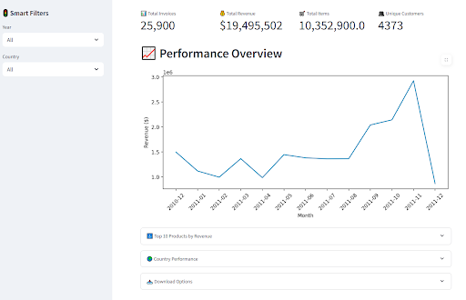
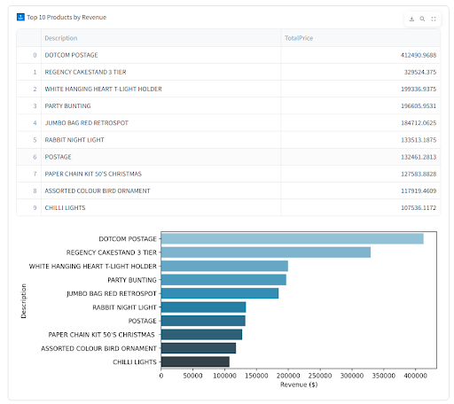
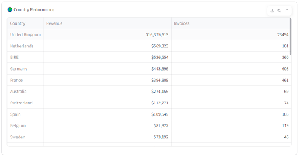
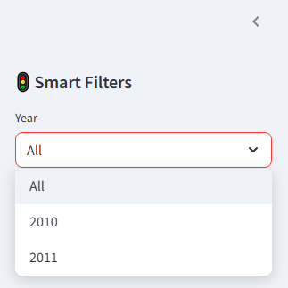
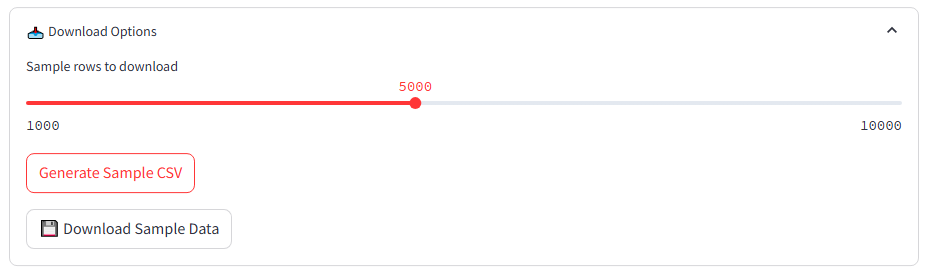

# 💼 Freelance Data Project: E-Commerce Analytics Dashboard  

## 📸 Dashboard Walkthrough  

| Feature              | Preview                                                                 |
|----------------------|-------------------------------------------------------------------------|
| **Performance Overview** |            |
| **Top 10 Products**      |  *← Fix typo!*   |
| **Country Analysis**     |              |
| **Smart Filters**        |                                |
| **Data Export**          |                     |


### **🚀 Client-Ready Features**  
| Feature           | Business Value                          |  
|-------------------|----------------------------------------|  
| **Real-time KPIs**  | Track revenue, invoices, and customer stats at a glance |  
| **Country/Year Filters** | Slice data for regional/seasonal analysis |  
| **Top Products** | Identify best-sellers and revenue drivers |  
| **CSV Export** | Download filtered data for further client reporting |  

## **🛠️ Built With**  
- **Data Processing**: Python (Pandas)  
- **Dashboard**: Streamlit *(no frontend skills needed!)*  
- **Visualizations**: Seaborn/Matplotlib *(client-friendly charts)*  
- **Performance**: Cached data loading for 1M+ rows  

## **📌 Why This Project?**  
This demo solves **3 common client needs**:  
1. **Performance**: Handles large datasets efficiently.  
2. **Customization**: Filters adapt to specific business questions.  
3. **Actionable Insights**: From trends to top products.  

## **⚡ Quick Start**  
1. Clone repo:  
   ```bash  
   git clone https://github.com/your-username/Ecom-Dashboard-Analytics.git  
